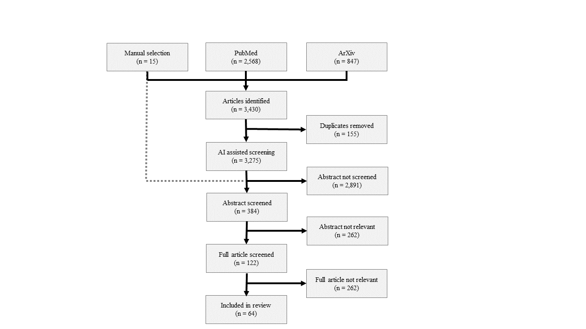

```{r setup, include=FALSE}
knitr::opts_chunk$set(echo = TRUE)
source("./review_functions.R")
```

# Literature review

## Methods

Briefly, we searched relevant publications on PubMed and ArXiv that describe quantitative evaluations of missing data methods. Initially, we identified 15 relevant papers in which several statistical and machine learning imputation techniques were compared through simulation. These 15 papers served to inform an active learning literature review with the software ASReview [software ref]. ASReview is a machine-learning aided framework for efficient screening of titles and abstracts [nature ref]. To achieve full merit of the framework, a 'stopping criterion' is required--in our case when the software had selected all 15 priorly identified publications. A flow diagram of the review methods is presented in Figure [...]. We made use of the following inclusion and exclusion criteria:

- Inclusion criteria: the paper concerns an evaluation of missing data methods through simulation; the paper matches the search query "(simulation[Title/Abstract]) AND ((missing[Title/Abstract]) OR (incomplete[Title/Abstract]))"; the paper is selected by ASReview before the stopping criterion is reached.

- Exclusion criteria during abstract screening: the paper does not concern an evaluation of missing data methods through simulation; the paper concerns a datatype that deviates from typical EHR data (e.g., imaging data, free text data, traffic sensor data); the paper only concerns (variations of) the _analysis_ model, not the _imputation_ model; the paper only concerns (variations of) one missing data method.

- Exclusion criteria during full text screening (all of the above, plus): the paper only concerns two missing data methods, one of which is complete case analysis; the paper only concerns single-patient data; the paper only concerns a MCAR missingness mechanism (equivalently, the paper does not concern MAR, MNAR or empirical missingness mechanisms).


<!-- -	AI assisted reviewing, see Nature publication ASReview -->

<!-- -	literature search PubMed and ArXiv with inclusion criteria: missing/incomplete, simulation -->


<!-- -	manual selection of 15 relevant articles for stopping criterion AI assisted reviewing -->

<!-- -	removed duplicates, start screening abstracts selected by ASReview -->

<!-- -	stop screening when 15 manually selected articles are ‘found’ by ASReview -->

<!-- -	screen full articles with inclusion criteria: missingness empirical/MAR/MNAR (not MCAR), -->

<!-- -	flow chart of methods presented in Figure: -->

After omitting duplicates and removing papers that did not meet the inclusion criteria or did meet the exclusion criteria, we obtained 67 publications. These are listed on [zotero.org/groups/4418459/clinical-applications-of-ai/library](zotero.org/groups/4418459/clinical-applications-of-ai/library). 

## Results

Results from the simulation studies reported in the 67 papers are summarized in Figure [...]. Each row in this figure represents one method of accommodating missing data, in order of appearance in this chapter (i.e., single imputation methods, multiple imputation methods, non-parametric imputation methods, non-imputation methods, and specialized methods for MNAR and longitudinal datatypes). The cells in Figure [...] display the number of papers in which the method in the row outperforms the method in the column. Methods that work comparatively well have a higher percentage of papers in which they outperform other methods, signified by rows with many green cells. 


**Note:** *percentage of papers in which the method in the row outperforms the method in the column. Abbreviations: SVI = single value imputation, EVI = expected value imputation, JMI = joint modeling imputation, CMI = conditional modeling imputation, nearest = nearest neighbors, matrix =  matrix factorization, tree-based = tree-based ensembles, SVM = support vector machines, generative = generative methods, CCA = complete case analysis, likelihood = likelihood-based methods, pattern = missing data pattern methods, HTI - Heckman-type imputation, interpolation = interpolation methods (incl. last observation carried forward), RNN = recurrent neural networks. \newline 

Methods that appears to do well across the board are the cluster of generative methods (e.g., auto-encoders and convolution neural networks) and recurrent neural networks. Support vector machines also outperform all methods in comparison, but there is little information to base this conclusion on. As a general observation, the non-parametric methods perform comparatively better than the statistical imputation methods or non-imputation methods. Non-parametric methods may, however, not be suited for inference purposes--then, CMI or missing data pattern methods may be preferred.

This literature supports our earlier statement against the use of single imputation methods. This method performs worse than any other method in comparison. Another method with comparative under-performance is complete case analysis. This method was often included as a benchmark: missing data methods should perform at least as well as ignoring the missing instances altogether. Most of the other methods do indeed outperform this benchmark.

This review highlights a couple of gaps in the literature. Methods that seem promising, but have not been extensively studied are SVM and Heckman-type imputation. Also, there does not seem to be consensus on how to evaluate missing data methods (e.g., what types of missingness to consider or which performance measures to use). There should be guidelines for reporting, to facilitate fair comparisons between methods. For reasons of brevity, this review did not report on interactions between methods, such as the tree-based methods implemented within the `mice` framework. Uniting statistical and machine learning methods holds a promise to obtain imputations that are both accurate and confidence valid.


## References

Van de Schoot, R., de Bruin, J., Schram, R. et al. An open source machine learning framework for efficient and transparent systematic reviews. Nat Mach Intell 3, 125–133 (2021). www.nature.com/articles/s42256-020-00287-7

Van de Schoot, R., De Bruin, J., Schram, R., Zahedi, P., De Boer, J., Weijdema, F., Kramer, B., Huijts, M., Hoogerwerf, M., Ferdinands, G., Harkema, A., Willemsen, J., Ma, Y., Fang, Q., Tummers, L., & Oberski, D. (2021). ASReview: Active learning for systematic reviews. Zenodo. https://doi.org/10.5281/zenodo.5126631


# [OLD TEXT AFTER THIS]

# Introduction

- missing data is problematic and inevitable when working with RWD in a clinical setting

- there has been a shift from CCA to stats to ML methods to handle missing data

- ML methods appear to be better suited for empirical data, where assumptions of CCA and stats methods do not hold

- this review aims to summarize simulation studies into missing data methods

# Methods

- AI assisted reviewing, see Nature publication ASReview

- literature search PubMed and ArXiv with inclusion criteria: missing/incomplete, simulation, ...

- manual selection of 15 relevant articles for stopping criterion AI assisted reviewing

- removed duplicates, start screening abstracts selected by ASReview

- stop screening when 15 manually selected articles are 'found' by ASReview

- screen full articles with inclusion criteria: missingness empirical/MAR/MNAR (not MCAR), ...

- flow chart of methods presented in Figure:



# Results


- complete results presented in Figure:

```{r results, eval=FALSE, fig.dim=c(16,9), message=FALSE, warning=FALSE, include=FALSE}
plot_results(results_full_data, "Comparison of missing data methods, MAR, MNAR and 'real' missingness")
```

- results for cross-sectional data

```{r eval=FALSE, fig.dim=c(16,9), message=FALSE, warning=FALSE, include=FALSE}
results_MAR_cros +
results_MNAR_cros +
results_emp_cros +
    plot_layout(guides = 'collect')
```


- results for longitudinal data


```{r eval=FALSE, fig.dim=c(16,9), message=FALSE, warning=FALSE, include=FALSE}
results_MAR_long +
results_MNAR_long +
results_emp_long +
    plot_layout(guides = 'collect')
```


